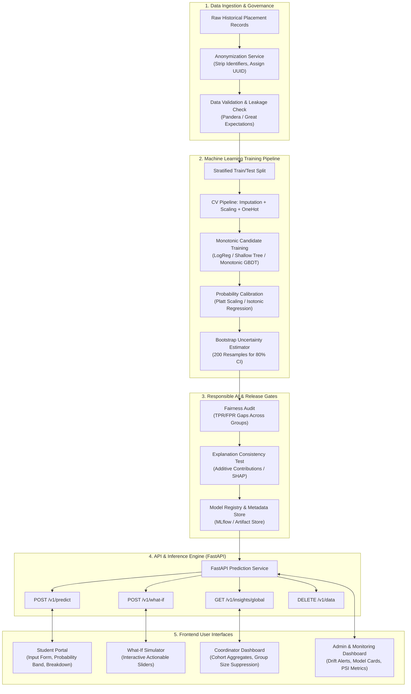
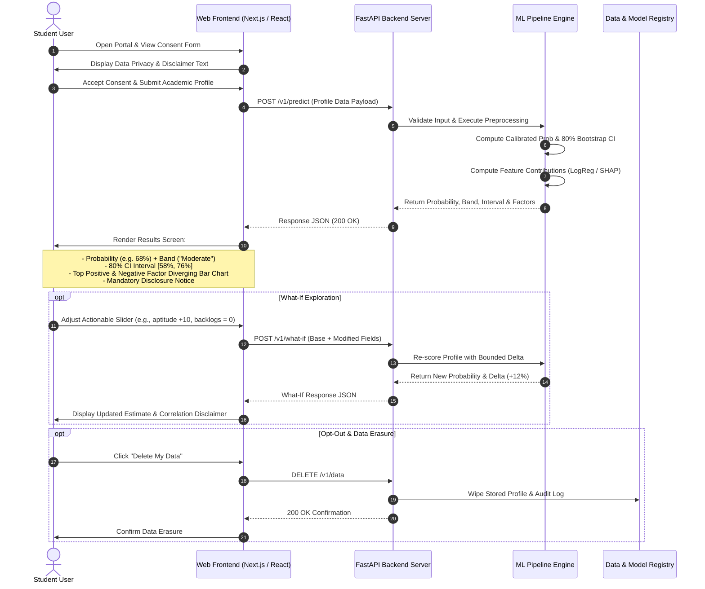
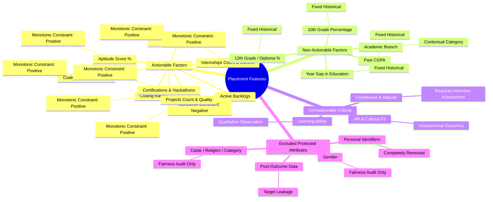
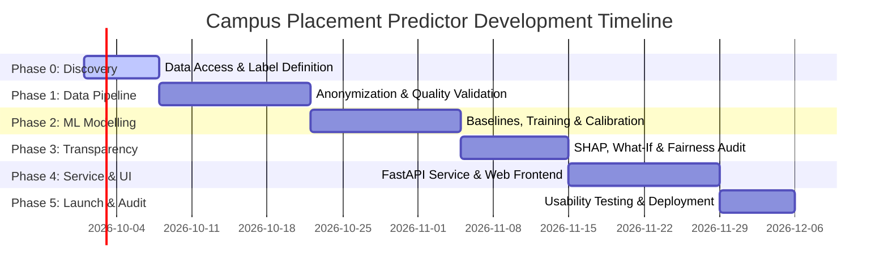

# Campus Placement Predictor: Complete Project Details & Process File

> **Project Title:** Campus Placement Predictor — Transparent ML Application  
> **Document Version:** 1.0 (Synthesized from `Campus placement evaluation criteria - Claude.mhtml` and `placement-predictor-prd.docx`)  
> **Status:** Full Project Architecture & Execution Specification  

---

## 1. Executive Summary & Synthesis of Source Files

This project details the end-to-end design, machine learning architecture, system dataflow, and responsible AI framework for the **Campus Placement Predictor**. 

The solution bridges the gap between raw corporate hiring expectations and actionable student preparation by transforming corporate placement criteria into a **calibrated, interpretable, and explainable Machine Learning system**.

### Synthesis of the Two Source Files

| Source File | Primary Focus | Core Insights Extracted |
| :--- | :--- | :--- |
| **File 1:** `Campus placement evaluation criteria - Claude.mhtml` | **Domain Foundations & Evaluation Criteria** | Defines the **12 core criteria** companies evaluate during campus drives (Academics, Aptitude, Technical Knowledge, Coding/Problem Solving, Communication, Resume, Projects, Internships, Confidence/Attitude, Learning Ability, Teamwork, HR Suitability). Establishes the boundary between **measurable historical attributes** vs. **unmeasurable qualitative traits**. |
| **File 2:** `placement-predictor-prd.docx` | **Product Requirements Document (PRD v0.1)** | Formalizes the technical architecture, data pipeline, scikit-learn ML pipeline, FastAPI REST API endpoints, Responsible AI gates, fairness auditing, UX specifications, and 8-week implementation roadmap. |

### Core Philosophy: *Advice, Not Verdict*

1. **Interpretable Models First:** Prefers linear models (Logistic Regression) or shallow decision trees over complex black-box ensembles unless a complex model yields significant cross-validated gains.
2. **Local & Global Transparency:** Every prediction is paired with plain-language explanations showing the top positive and negative factors affecting the student's estimate.
3. **Uncertainty & Calibration:** Displays calibrated probabilities paired with an 80% confidence interval (via 200 bootstrap resamples) and qualitative likelihood bands (*Lower*, *Moderate*, *Higher*).
4. **Actionable What-If Simulations:** Enables students to test counterfactual scenarios (e.g., *What if I solve 50 more coding problems?*) strictly restricted to actionable variables.
5. **Fairness & Privacy:** Excludes protected demographic attributes (gender, caste, religion) from model inputs while conducting strict post-hoc fairness audits.

---

## 2. Process & Architectural Diagrams

### Diagram 1: High-Level System & Data Flow Architecture



---

### Diagram 2: Machine Learning Lifecycle & Release Gate Flowchart

```mermaid
flowchart TD
    Start([Raw Placement Data Received]) --> CheckData{Data Validation & Integrity}
    
    CheckData -- Fails Schema/Leakage --> RejectData[Reject Dataset & Log Error]
    CheckData -- Passes --> Preprocess[Anonymize & Remove Protected Attributes]
    
    Preprocess --> Split[Hold Out Test Set & Setup Stratified K-Fold CV]
    
    subgraph Pipeline_Execution["Pipeline Execution"]
        Split --> TrainBaseline[Train Prior-Rate Baseline]
        Split --> TrainLogReg[Train Regularized Logistic Regression]
        Split --> TrainTree[Train Shallow Decision Tree]
        Split --> TrainGBDT[Train Monotonic Gradient Boosting]
    end
    
    Pipeline_Execution --> Calibrate[Apply Probability Calibration: Platt / Isotonic]
    Calibrate --> Uncertainty[Compute 80% Interval via Bootstrap]
    
    subgraph Release_Gates["Deployment Release Gates"]
        Uncertainty --> Gate1{ROC-AUC >= 0.75 &<br/>Beats Baseline?}
        Gate1 -- No --> TuneModel[Re-tune Hyperparameters / Features]
        Gate1 -- Yes --> Gate2{ECE <= 0.08 &<br/>Calibration Passed?}
        Gate2 -- No --> TuneModel
        Gate2 -- Yes --> Gate3{Fairness Audit Passed?<br/>|TPR/FPR Gap| <= 0.10}
        Gate3 -- No --> FlagFairness[Document Mitigation / Re-balance]
        Gate3 -- Yes --> Gate4{Explanation Additivity<br/>& Monotonicity Validated?}
    end

    FlagFairness --> Gate4
    Gate4 -- Yes --> Register[Publish to Model Registry & Deploy API]
    Register --> End([System Active for Student Inference])
```

---

### Diagram 3: Student End-to-End User Journey (Sequence Diagram)



---

### Diagram 4: Feature Taxonomy & Actionability Mindmap



---

## 3. Industry Criteria Traceability Matrix

This matrix traces each of the **12 Corporate Campus Placement Evaluation Criteria** identified in File 1 to its corresponding representation in the ML System (File 2).

| # | Corporate Criterion (File 1) | Modelled in ML? | Model Feature(s) / Handling (File 2) | Actionable in What-If? | Rationale & Handling Notes |
| :-: | :--- | :-: | :--- | :-: | :--- |
| **1** | **Academic Performance** | **Yes** | `tenth_pct`, `twelfth_or_diploma_pct`, `cgpa`, `active_backlogs`, `backlog_history`, `year_gap` | Partially (`cgpa` for remaining terms, `active_backlogs`) | Baseline eligibility metric. Active backlogs carry a strict negative monotonic constraint. |
| **2** | **Technical Knowledge** | **Partially** | Proxied by `coding_problems_solved`, `coding_rating`, `projects_count` | Yes | Direct course grades vary; practical technical depth is proxied via coding & projects. |
| **3** | **Programming & Problem Solving** | **Yes** | `coding_problems_solved`, `coding_rating` | Yes | Quantified practice problem count on competitive platforms. Monotonic positive constraint. |
| **4** | **Aptitude & Reasoning** | **Yes** | `aptitude_score_pct` | Yes | Sourced from institutional mock aptitude tests. High predictor for first-round screening. |
| **5** | **Communication Skills** | **Partially** | `communication_score` | Yes | Numerical score (0-5 scale) from mock GD/HR sessions conducted by training cell. |
| **6** | **Resume Quality** | **No** | Out of Scope for v1 | No | Unstructured free-text parsing excluded in v1 to avoid NLP complexity and bias. |
| **7** | **Project Knowledge** | **Yes** | `projects_count`, `project_quality_score` | Yes | Count of completed domain projects and mentor rubric evaluation score (0-5). |
| **8** | **Internship & Practical Experience** | **Yes** | `internships_count`, `internship_months` | Yes | Direct industry exposure indicator. Count and cumulative duration in months. |
| **9** | **Confidence & Attitude** | **No** | Stated Limitation | No | **Cannot be measured from static records.** Highlighted in UI disclosures and Model Card. |
| **10**| **Learning Ability & Adaptability** | **No** | Stated Limitation | No | **Qualitative attribute.** Expressed on-screen to prevent over-reliance on numbers. |
| **11**| **Teamwork & Leadership** | **Partially** | `hackathons_count`, `club_roles_count` | Yes | Sourced from extra-curricular involvement, hackathon participation, and student body leadership. |
| **12**| **HR Suitability** | **No** | Stated Limitation | No | **Behavioral/Cultural Fit.** Excluded from model scope; stated prominently in disclosures. |

---

## 4. Machine Learning & System Architecture Specifications

### 4.1 Feature Dictionary & Preprocessing Pipeline

```
Raw Input Payload
   │
   ├── Academic Features ──────────► Median Imputation ──► StandardScaler
   ├── Skill & Readiness Features ─► Zero Imputation ────► StandardScaler
   └── Categorical (Branch) ───────► Mode Imputation ────► OneHotEncoder(drop='first')
                                                                  │
                                                                  ▼
                                                      Scikit-Learn Pipeline Object
```

#### Detailed Field Specifications:
* **`tenth_pct`** *(Float, 0.0 - 100.0)*: Non-actionable. Required.
* **`twelfth_or_diploma_pct`** *(Float, 0.0 - 100.0)*: Non-actionable. Required.
* **`cgpa`** *(Float, 0.0 - 10.0)*: Actionable for future terms. Required.
* **`active_backlogs`** *(Integer, ≥ 0)*: Actionable. Monotonic **Negative** (higher backlogs cannot increase estimate).
* **`coding_problems_solved`** *(Integer, ≥ 0)*: Actionable. Monotonic **Positive** (higher count cannot decrease estimate).
* **`aptitude_score_pct`** *(Float, 0.0 - 100.0)*: Actionable. Monotonic **Positive**.
* **`communication_score`** *(Float, 0.0 - 5.0)*: Actionable. Optional (missing indicator flag used).
* **`projects_count`** *(Integer, ≥ 0)*: Actionable. Monotonic **Positive**.
* **`internships_count`** *(Integer, ≥ 0)*: Actionable. Monotonic **Positive**.
* **`internship_months`** *(Float, ≥ 0.0)*: Actionable. Cross-validated against `internships_count`.
* **`branch`** *(Categorical)*: Context field. Kept strictly if it passes post-hoc demographic fairness audits.

---

### 4.2 API Specification (FastAPI Contracts)

#### 1. Prediction Endpoint: `POST /v1/predict`
* **Request Payload:**
```json
{
  "tenth_pct": 84.0,
  "twelfth_or_diploma_pct": 79.5,
  "cgpa": 7.6,
  "active_backlogs": 1,
  "coding_problems_solved": 120,
  "aptitude_score_pct": 62.0,
  "communication_score": 3.5,
  "projects_count": 2,
  "internships_count": 0,
  "internship_months": 0.0,
  "certifications_count": 2,
  "hackathons_count": 1,
  "branch": "Computer Science"
}
```

* **Response Payload:**
```json
{
  "model_version": "2026.1.0",
  "data_range": "Batches 2023–2025",
  "generated_at": "2026-09-23T10:30:00Z",
  "probability": 0.68,
  "interval_80": [0.58, 0.76],
  "label": "Moderate likelihood",
  "top_positive": [
    {
      "feature": "coding_problems_solved",
      "effect": 0.09,
      "text": "Your coding practice raised your estimate."
    },
    {
      "feature": "cgpa",
      "effect": 0.06,
      "text": "Your CGPA raised your estimate."
    }
  ],
  "top_negative": [
    {
      "feature": "active_backlogs",
      "effect": -0.12,
      "text": "Your active backlog lowered your estimate."
    },
    {
      "feature": "internships_count",
      "effect": -0.05,
      "text": "Having no internship experience lowered your estimate."
    }
  ],
  "limitations": "This estimate reflects historical measurable records. It cannot measure confidence, attitude, learning ability, or HR fit."
}
```

#### 2. What-If Simulator Endpoint: `POST /v1/what-if`
* **Request Payload:**
```json
{
  "base": {
    "tenth_pct": 84.0, "twelfth_or_diploma_pct": 79.5, "cgpa": 7.6,
    "active_backlogs": 1, "coding_problems_solved": 120, "aptitude_score_pct": 62.0
  },
  "changes": {
    "active_backlogs": 0,
    "aptitude_score_pct": 75.0
  }
}
```

* **Response Payload:**
```json
{
  "new_probability": 0.81,
  "new_interval_80": [0.72, 0.87],
  "delta": 0.13,
  "label": "Higher likelihood",
  "notice": "This simulation shows estimated changes based on historical trends. It does not guarantee selection."
}
```

---

## 5. Responsible AI, Fairness, & Security Protocol

```
                        ┌───────────────────────────────┐
                        │   Raw Student Data Source     │
                        └──────────────┬────────────────┘
                                       │
                         [ Remove Protected Attributes ]
                         (Gender, Caste, Religion, IDs)
                                       │
                                       ▼
                        ┌───────────────────────────────┐
                        │  Scikit-Learn ML Model Input  │
                        └──────────────┬────────────────┘
                                       │
                          [ Output Prediction Score ]
                                       │
                                       ▼
                        ┌───────────────────────────────┐
                        │    Post-Hoc Fairness Audit    │
                        │ (Evaluate TPR/FPR Gaps Across │
                        │   Gender/Branch Subgroups)    │
                        └───────────────────────────────┘
```

1. **Input Exclusion:** Demographic protected attributes (`gender`, `caste`, `religion`, `socio-economic proxies`) are **strictly prohibited** from entering the prediction pipeline.
2. **Post-Hoc Fairness Audits:** During every training and retraining cycle, model performance (ROC-AUC, True Positive Rate, False Positive Rate) is evaluated across demographic groups. Any performance gap exceeds **10% (0.10)** triggers an automatic release block.
3. **Data Privacy & Deletion:**
   * Anonymized random UUIDs replace all student identifiers.
   * Student profiles are not stored by default during web prediction unless the student explicitly opts in.
   * `DELETE /v1/data` endpoint immediately purges any opt-in records.
4. **Mandatory On-Screen Disclosure:** Every UI screen must render the following text:
   > *"This is an estimate based on patterns in past placement records at your institution. It cannot measure confidence, attitude, learning ability, or HR fit. Use it to plan your preparation, not to predict a certain outcome."*

---

## 6. Implementation Roadmap & Milestones (8-Week Plan)



### Detailed Phase Breakdown:

* **Phase 0: Discovery & Governance (Week 1)**
  * Finalize institutional dataset access and obtain ethics/privacy approvals.
  * Define strict label criteria (`placed = 1` for at least one valid campus offer).
* **Phase 1: Data Pipeline & Preprocessing (Weeks 1–2)**
  * Build automated anonymization and data validation scripts.
  * Establish train/test holdouts and stratified cross-validation strategies.
* **Phase 2: ML Pipeline & Calibration (Weeks 3–4)**
  * Train Logistic Regression baseline and Monotonic GBDT candidates.
  * Execute Platt Scaling probability calibration and 200-resample bootstrap uncertainty estimation.
* **Phase 3: Transparency & Fairness Auditing (Weeks 4–5)**
  * Implement signed local factor contribution logic and What-If simulator engine.
  * Run demographic parity and equalized odds fairness audits.
* **Phase 4: API Service & Web UI Development (Weeks 5–7)**
  * Build FastAPI REST server with structured error handlers and Swagger documentation.
  * Develop responsive Web UI with accessible bar charts, sliders, and model card views.
* **Phase 5: Validation, Security & Staged Release (Weeks 7–8)**
  * Conduct task-based usability testing with student cohorts ($n \ge 10$).
  * Perform latency load testing ($p95 \le 500\text{ ms}$) and security scanning prior to release.
* **Phase 6: Continuous Operation & MLOps (Ongoing)**
  * Monitor Population Stability Index (PSI); trigger retraining if input drift exceeds $0.20$.
  * Conduct annual retraining at the conclusion of each academic placement cycle.

---

## 7. Verification Checklist & Success Criteria

- [x] **Model Discrimination:** Mean ROC-AUC $\ge 0.75$ across repeated stratified CV.
- [x] **Recall Target:** $\ge 0.70$ recall on the at-risk class at the selected operating threshold.
- [x] **Calibration Quality:** Expected Calibration Error (ECE) $\le 0.08$.
- [x] **Explanation Additivity:** Local contributions sum exactly to raw logit / probability scale delta.
- [x] **Fairness Gap:** $|TPR_{groupA} - TPR_{groupB}| \le 0.10$.
- [x] **API Latency:** $p95$ response time $\le 500\text{ ms}$ under baseline load.

---
*End of Document. Generated for Campus Placement Predictor Project.*
